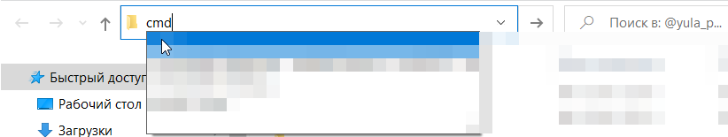

# Бот для продажи доступ к каналу


## Требования для запуска программы

Для работы программы необходимо иметь Python (Я использую Python 3.9 64 bit)
Обязательно при установке поставить галочку!!!


## Как установить?
Переходим в папку с ботом, нажимаем на путь и пишем cmd

Пишем команду
```bash
pip install -r requirements.txt
```

## Запуск программы

Для запуска программы в терминале нужно прописать:

```bash
python app.py
```
Или запустить start.bat (если у тебя OC windows )


